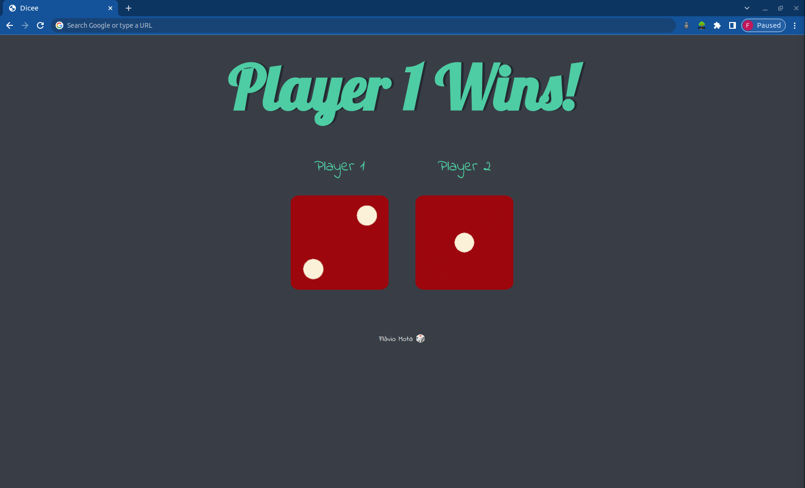
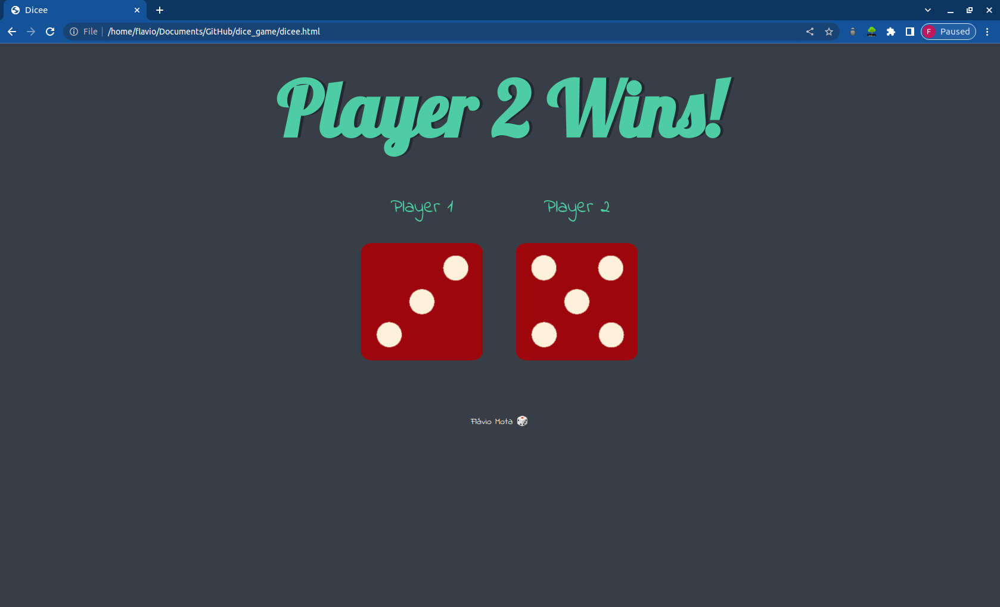
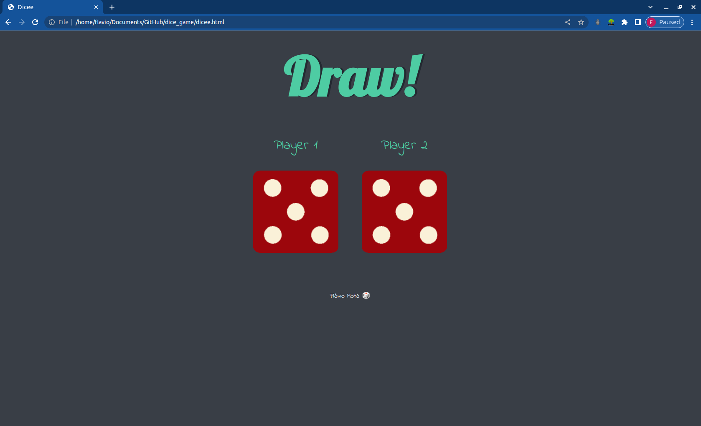

# Dice Game

In this project, the objective is to create a website using HTML, CSS and JavaScript that allows us to understand who won between two players in a game of dice.

## Player 1 Wins!

## Player 2 Wins!

## Draw!

